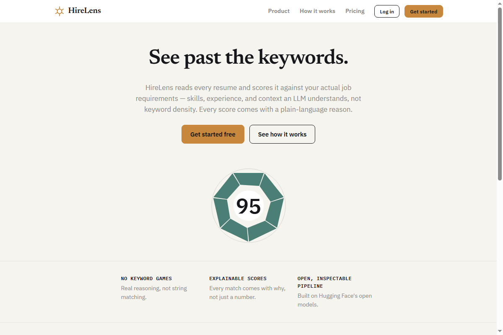
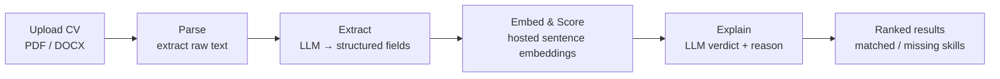
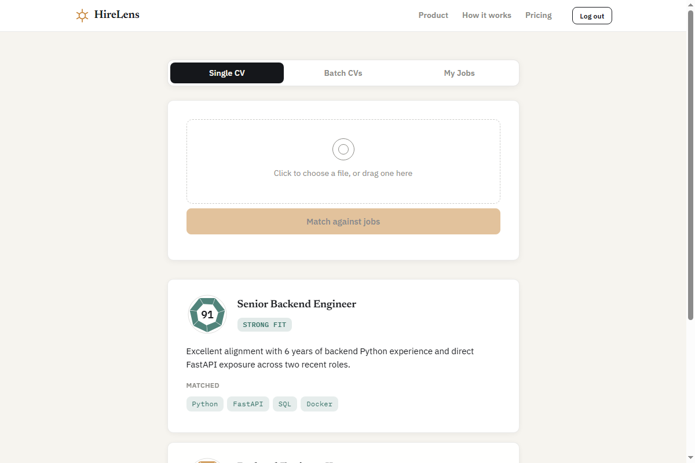

<div align="center">

# HireLens

**See past the keywords.**

HireLens reads every resume and scores it against your actual job requirements —
skills, experience, and context an LLM understands, not keyword density.
Every score comes with a plain-language reason.


</div>

<p align="center">
  
</p>

## Contents

- [What it does](#what-it-does)
- [How it works](#how-it-works)
- [Screenshots](#screenshots)
- [Tech stack](#tech-stack)
- [Getting started](#getting-started)
- [Environment variables](#environment-variables)
- [API endpoints](#api-endpoints)
- [Project structure](#project-structure)
- [Known limitations](#known-limitations)
- [Bigger picture](#bigger-picture)

## What it does

Upload a CV, get it scored against your open roles — as a single upload or a
batch of up to five — with a similarity score, a plain-language verdict, and
a matched/missing skills breakdown for each match. Recruiters manage their own
job postings and candidate pool behind email/password auth; every user's data
is isolated from every other user's.

- **Single & batch matching** — one CV against every job you own, or up to
  five CVs against one job at a time, ranked by fit.
- **Aperture score graphic** — match scores render as a camera-iris graphic
  that opens wider the stronger the match, instead of a plain percentage bar.
- **Explainable, not just a number** — an LLM writes a short verdict and
  reason for every match; matched/missing skills are computed deterministically
  in Python, not left to the model to get exactly right.
- **Job management** — full CRUD on job postings (title, description, required
  skills, minimum experience) from the same UI.
- **Accounts, scoped data** — JWT auth, email verification (real delivery via
  Resend, with a dev-mode fallback when it isn't configured), and per-user
  data isolation via `owner_id` on every job/candidate row.
- **Usage limits** — Redis-backed daily caps (global and per-user) on CV
  processing, plus signup rate limiting by IP, so the LLM bill stays bounded.
- **Swappable background processing** — CV extraction runs via Celery by
  default, or via FastAPI's `BackgroundTasks` with one env var flip when you
  don't want to run a separate worker process.

## How it works



1. **Parse** — raw text comes out of the PDF/DOCX (`app/parser.py`). A cheap
   keyword heuristic rejects obviously-non-CV documents before spending an
   LLM call on them.
2. **Extract** — an instruct LLM turns raw text into structured fields: name,
   skills, experience, titles, education (`app/extractor.py`).
3. **Match** — a sentence embedding (fetched from Hugging Face's hosted
   Inference API, not run locally) gives a fast similarity score between the
   CV and the job; an LLM then explains the fit and lists matched/missing
   skills (`app/matcher.py`).
4. **Serve** — single uploads are matched synchronously; batches are parsed
   immediately and extracted in the background, polled for status, then
   ranked and explained once every candidate is done (`app/main.py`).

## Screenshots

<p align="center">
  
</p>

<p align="center"><em>Each match renders as an aperture graphic — wide open and teal for a strong fit, narrower and amber or grey as the score drops.</em></p>

## Tech stack

| Layer | Choice |
|---|---|
| API | FastAPI + Pydantic v2 |
| Database | PostgreSQL via SQLAlchemy (`create_all()`, no Alembic yet) |
| Background jobs | Celery + Redis, or FastAPI `BackgroundTasks` (`TASK_BACKEND` toggle) |
| LLM + embeddings | Hugging Face Inference Providers (`huggingface_hub.InferenceClient`) |
| Auth | JWT bearer tokens (`python-jose`), `passlib`/`bcrypt` password hashing |
| Transactional email | Resend (optional — falls back to a dev-mode link if unset) |
| Rate limiting / usage caps | Redis counters, no extra service |
| Frontend | Single-file HTML/CSS/JS (`static/index.html`) — no build step, no framework |

## Getting started

### Prerequisites

- Python 3.10
- PostgreSQL, running and reachable
- Redis (or [Memurai](https://www.memurai.com/) on Windows) — used for usage
  limits/rate limiting regardless of `TASK_BACKEND`, and for Celery if you use it
- A [Hugging Face](https://huggingface.co/settings/tokens) access token

### Setup

```bash
git clone <this-repo>
cd ai-cv-matcher
python -m venv env
env\Scripts\activate          # Windows
# source env/bin/activate     # Linux/macOS

pip install -r requirements.txt
cp .env.example .env          # then fill in HF_TOKEN, DATABASE_URL, SECRET_KEY, ...
```

Generate a `SECRET_KEY`:

```bash
python -c "import secrets; print(secrets.token_hex(32))"
```

Run the API (creates tables on first startup):

```bash
uvicorn app.main:app --reload
```

Open `http://localhost:8000` for the app itself, or `http://localhost:8000/docs`
for the interactive API docs.

### Running background extraction

Batch uploads extract CVs in the background. Pick one:

**Option A — no extra process.** Set `TASK_BACKEND=fastapi` in `.env`. Extraction
runs in-process via `BackgroundTasks`. Simplest for local dev or a free-tier
deploy; no retry on transient failures.

**Option B — Celery worker (default).**

```bash
# Windows (the default `prefork` pool isn't Windows-safe):
celery -A app.celery_app worker --pool=solo --loglevel=info

# Linux/macOS:
celery -A app.celery_app worker --concurrency=5 --loglevel=info
```

## Environment variables

| Var | Default | Notes |
|---|---|---|
| `HF_TOKEN` | — (required) | Hugging Face Inference Providers auth |
| `DATABASE_URL` | — | PostgreSQL connection string |
| `SECRET_KEY` | — (required) | JWT signing key — generate, don't reuse the example |
| `REDIS_URL` | `redis://localhost:6379/0` | Celery broker + usage-limit counters |
| `TASK_BACKEND` | `celery` | `celery` (needs a worker) or `fastapi` (in-process, no worker) |
| `EXTRACTOR_MODEL` | `meta-llama/Llama-3.1-8B-Instruct` | Structured-extraction LLM |
| `MATCHER_MODEL` | `meta-llama/Llama-3.1-8B-Instruct` | Match-explanation LLM |
| `EMBED_MODEL` | `sentence-transformers/all-MiniLM-L6-v2` | Embedding model, hosted (not local) |
| `GLOBAL_DAILY_CV_CAP` | `30` | System-wide daily CV processing cap |
| `USER_DAILY_CV_CAP` | `10` | Per-user daily CV processing cap |
| `SIGNUP_RATE_LIMIT_PER_HOUR` | `3` | Signups per IP per hour |
| `RESEND_API_KEY` | — (optional) | Unset → signup returns a dev-mode verification link instead of emailing it |
| `FROM_EMAIL` | `onboarding@resend.dev` | Must be a Resend-verified sender/domain |
| `LOG_LEVEL` | `INFO` | Set `DEBUG` locally only — logs full CV text and raw model output |

See [`.env.example`](.env.example) for the full annotated template.

## API endpoints

All routes except auth/health require `Authorization: Bearer <token>`.

| Method & path | Purpose |
|---|---|
| `POST /auth/signup` / `POST /auth/login` | Create an account / get a token |
| `GET /auth/verify?token=...` | Verify email from the link |
| `POST /jobs` · `GET /jobs` · `GET/PUT/DELETE /jobs/{id}` | Job posting CRUD, scoped to the caller |
| `POST /match` | Upload one CV, match against every job you own |
| `POST /candidates/batch` | Upload up to 5 CVs, extraction runs in the background |
| `GET /candidates/batch/{batch_id}` | Poll extraction status |
| `POST /candidates/{candidate_id}/retry-extraction` | Re-run extraction for a candidate stuck in `failed` |
| `GET /jobs/{job_id}/match-batch/{batch_id}` | Rank & explain a batch's extracted candidates against a job |
| `GET /health` | Liveness check, no auth |

Full request/response shapes: `/docs` (Swagger UI) once the API is running.

## Project structure

```
app/
├── main.py             # FastAPI app, all routes
├── auth.py             # JWT issuance/validation, get_current_user / get_verified_user
├── database.py         # SQLAlchemy engine/session
├── orm_models.py       # DB tables (User, JobPosting, Candidate)
├── schemas.py          # Pydantic request/response models
├── parser.py           # CV text extraction (PDF/DOCX)
├── extractor.py        # LLM structured extraction
├── matcher.py          # Embeddings + LLM match explanation
├── json_utils.py       # Defensive JSON parsing for raw LLM output
├── usage_limits.py     # Redis-backed daily caps + signup rate limiting
├── email_service.py    # Resend integration for verification email
├── tasks.py            # Extraction logic + Celery task wrapper
├── celery_app.py       # Celery app config
└── logging_config.py   # Console + rotating file logging

static/index.html       # Single-file frontend — landing page, auth, matching UI
docs/                    # Screenshots used in this README
```

## Known limitations

- No Alembic — schema changes go through `Base.metadata.create_all()`, which
  only creates missing tables and never alters existing ones.
- No password reset or refresh tokens (access tokens are just long-lived, 24h).
- `GET /jobs/{job_id}/match-batch/{batch_id}` also calls the LLM but isn't yet
  behind the usage-cap/verification gate that `/match` and `/candidates/batch` are.
- English-only extraction and matching.
- No OCR — scanned PDFs without a text layer are rejected, not processed.

## Bigger picture

HireLens is module 1 of a 3-module recruitment screening system: CV
screening/matching (this repo), timed psychometric testing, and an AI voice
interview agent. Modules 2 and 3 aren't started — this repo stays scoped to
CV matching.
